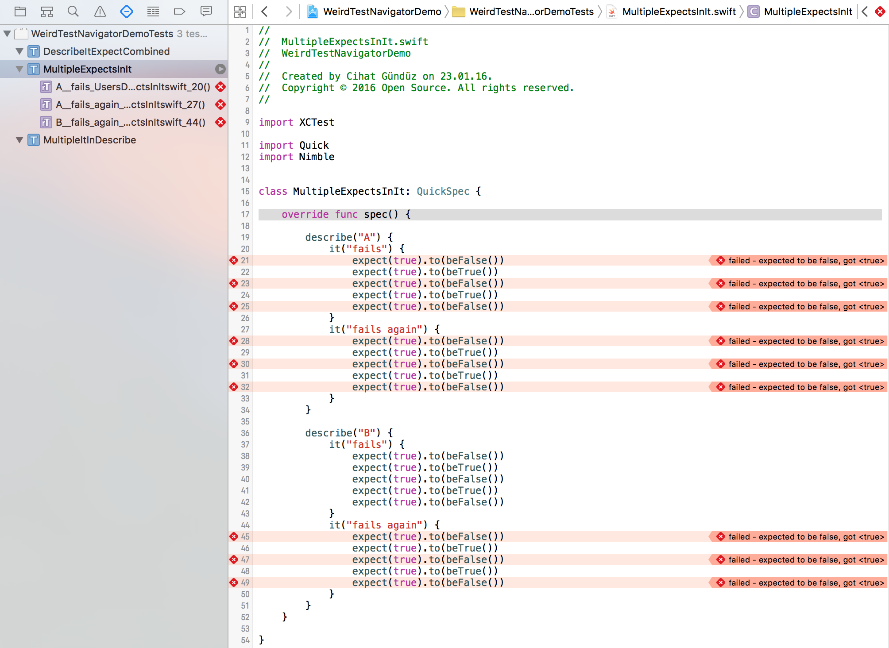

# Weird Test Navigator Demo

This is an example project with the goal of reproducing and investigating a bug that appeared in XCode 7.2's test navigator when usig Quick (and Nimble). See [this issue](https://github.com/Quick/Quick/issues/439) for more details.

## How to reproduce

Before you can run the tests in this project you need to first install Quick and Nimble. To do so you need Carthage installed (you can learn more about Carthage [here](https://github.com/Carthage/Carthage)) then you can just run `carthage bootstrap --platform ios` from the command line. To check if the issue was solved with a newer version of Quick just run `carthage update --platform ios` instead.

Run all tests within one file (not all tests at once) by using the test navigator and pressing the Play-like button on the test class names right end. For example running the tests within the class `MultipleExpectsInIt` will produce something like this for me:

